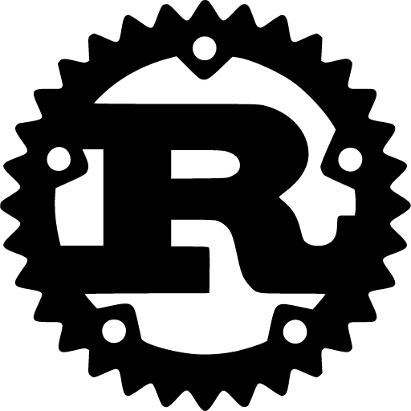
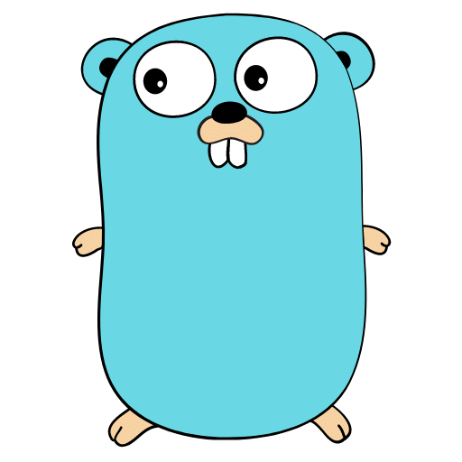
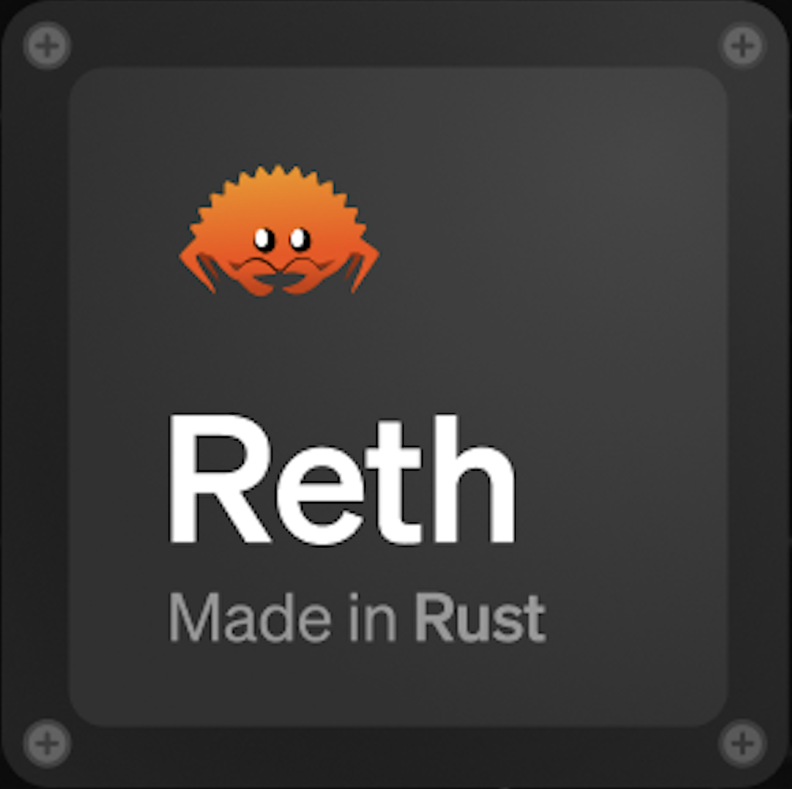
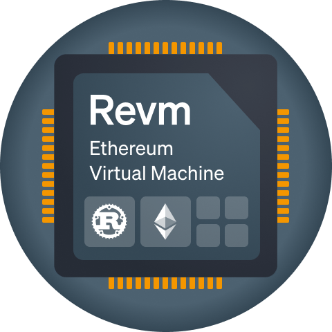
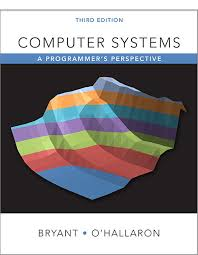
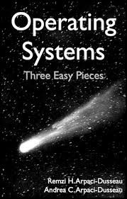
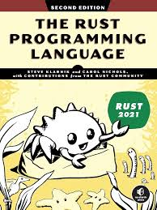
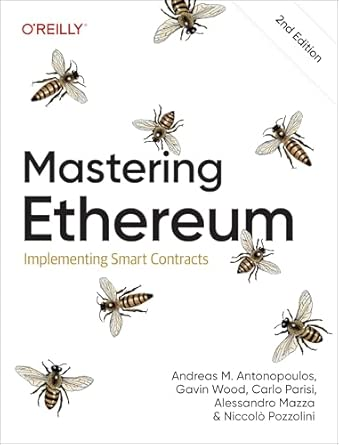
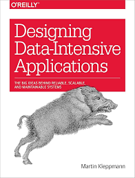

# Hi, I'm Yee

Computer Science student focusing on Rust, systems programming, blockchain infrastructure, and distributed systems.

## About Me

- Interested in Rust, operating systems, Ethereum, storage systems, and distributed systems
- Currently focus on developing Ethereum execution layer
- Previously worked on **[fuzzland](https://github.com/fuzzland)** as a software engineer
- My dream is to be a core dev for Ethereum!!

## Tech Stack

<table>
  <tr>
    <td align="center" width="90">
       
      <b>Rust</b>
    </td>
    <td align="center" width="90">
       
      <b>Golang</b>
    </td>
    <td align="center" width="90">
       
      <b>Reth</b>
    </td>
    <td align="center" width="90">
       
      <b>REVM</b>
    </td>
    <td align="center" width="90">
       
      <b>Raft</b>
    </td>
    <td align="center" width="90">
       
      <b>StarryOS</b>
    </td>
  </tr>
</table>

## `Protocol Work`

- [`paradigmxyz/reth` #2738](https://github.com/paradigmxyz/reth/pull/24106): document storage consistency for writers
- [`bluealloy/revm` #2778](https://github.com/bluealloy/revm/pull/3668): split local execution tracer modules

## The books inspiring ME!

<table>
  <tr>
    <td align="center" width="130">
       
      <b>CSAPP</b>
    </td>
    <td align="center" width="130">
       
      <b>OSTEP</b>
    </td>
    <td align="center" width="130">
       
      <b>The Rust Programming Language</b>
    </td>
    <td align="center" width="130">
       
      <b>Mastering Ethereum</b>
    </td>
    <td align="center" width="130">
       
      <b>Designing Data-Intensive Applications</b>
    </td>
  </tr>
</table>

## The Papers inspiring ME!

| Area | Paper | Keywords |
|---|---|---|
| Blockchain | **Bitcoin: A Peer-to-Peer Electronic Cash System** | PoW, UTXO, consensus, incentives |
| Distributed Computing | **MapReduce: Simplified Data Processing on Large Clusters** | batch processing, fault tolerance, data locality |
| Distributed Storage | **The Google File System** | chunkserver, master metadata, replication |
| Distributed Storage | **Decentralized Storage on Large Dynamic Datasets with Applications for Large Decentralized KV Store** | dynamic sharding, decentralized KV store, scalability |
| Consensus | **In Search of an Understandable Consensus Algorithm (Raft)** | leader election, log replication, safety |

---